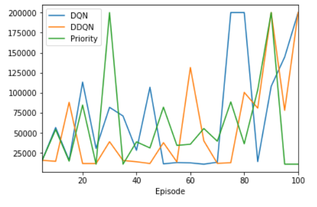

# EE-556-Final-Project
EE 556 Final Project

In this project, we have implemented deep reinforcement learning using DQN and DDQN agents with and without Priortized Experience replay on several agents. In second part of project, we have implemented Quantile regression Distribution learning and observed the rewards gained by environments

